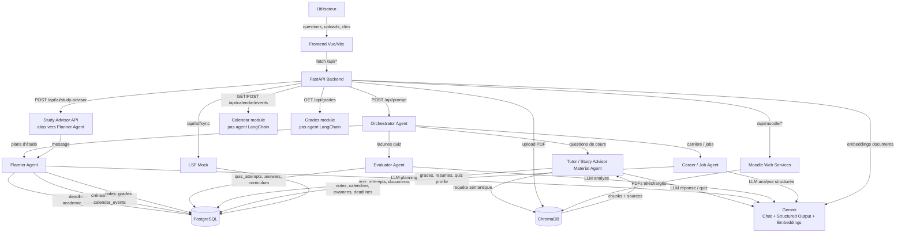
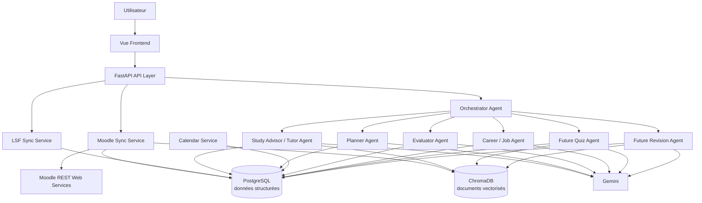

# Analyse technique - AI Study & Career Agent

Ce document décrit l'architecture actuelle du projet `Adaptive Study & Career Agent` telle qu'elle est implémentée dans le code.

## 1. Architecture globale

### Backend utilisé

Le backend est une API Python basée sur:

- **FastAPI**: point d'entrée dans `backend/app/main.py`.
- **SQLAlchemy async + asyncpg**: accès PostgreSQL via `backend/app/core/database.py`.
- **PostgreSQL 16**: base relationnelle lancée par `backend/docker-compose.yml`.
- **ChromaDB**: base vectorielle pour le RAG, lancée par Docker sur le port `8000`.
- **LangChain 1.x / LangGraph**: agents créés avec `langchain.agents.create_agent`.
- **Google Gemini**:
  - modèle chat: `gemini-3.1-flash-lite-preview`;
  - modèle embeddings: `gemini-embedding-001`.
- **pypdf**: extraction texte des PDFs uploadés, CV et documents Moodle.
- **httpx**: appels HTTP vers Moodle et les APIs de jobs.
- **LSF Mock interne**: source locale simulée pour notes, calendrier, examens et deadlines.
- **Moodle Web Services**: intégration optionnelle via `MOODLE_TOKEN`.

Technologies mentionnées mais non réellement utilisées dans le code actuel:

- **n8n**: aucune intégration n8n n'est présente.
- **OpenAI / Anthropic**: variables dans `Settings`, mais les agents utilisent Gemini.
- **MCP servers**: dossier présent, mais aucune logique métier active n'y est branchée.

### Frontend utilisé

Le frontend est une SPA:

- **Vue 3**
- **Vite**
- **marked** pour rendre les réponses Markdown du chat
- Fichier principal: `frontend/src/App.vue`
- Entrée: `frontend/src/main.js`
- Proxy Vite: `/api` vers `http://localhost:8080`

Le frontend contient les vues suivantes:

- Chat principal avec streaming SSE depuis `/api/prompt`
- Upload PDF
- Quiz / statistiques / profil de maîtrise
- Planner
- Calendrier
- Notes
- Career
- Moodle
- Curriculum / Modulhandbuch
- Profil/reset

### Communication entre composants

Flux principal:

1. L'utilisateur interagit avec Vue.
2. Vue appelle les endpoints FastAPI via `fetch('/api/...')`.
3. FastAPI délègue:
   - aux agents LangChain/LangGraph pour les réponses IA;
   - aux services Python pour Moodle, LSF, RAG, jobs, curriculum;
   - à PostgreSQL pour les données structurées;
   - à ChromaDB pour la recherche vectorielle.
4. Les agents utilisent Gemini pour raisonner ou générer des sorties structurées.
5. Le Tutor Agent utilise ChromaDB pour récupérer du contexte documentaire.
6. Moodle peut alimenter ChromaDB on-demand en téléchargeant des PDFs d'un cours.

Exemple concret:

```text
Frontend /api/prompt
  -> FastAPI prompt router
  -> OrchestratorAgent
  -> TutorAgent / PlannerAgent / EvaluatorAgent / CareerAgent
  -> PostgreSQL, ChromaDB, Moodle service selon le besoin
  -> Gemini
  -> réponse SSE vers le frontend
```

## 2. Liste complète des agents

### Orchestrator Agent

- **Nom**: `OrchestratorAgent`
- **Fichier**: `backend/app/agents/orchestrator.py`
- **Rôle**: superviseur multi-agent. Il reçoit une question utilisateur, choisit le ou les agents spécialisés et peut les chaîner.
- **Input**:
  - `message: str`
  - `chat_id`
  - `user_id`
  - session DB async
- **Output**:
  - réponse texte intégrée, en allemand par défaut dans le prompt système actuel.
- **Endpoint associé**:
  - `POST /api/prompt`
- **Services utilisés**:
  - `run_tutor_agent`
  - `run_evaluator_agent`
  - `run_planner_agent`
  - `run_career_agent`
  - Gemini via `get_llm`
- **Données stockées en base**:
  - `chat_messages`: prompt et réponse finale, après génération.
- **Communication avec autres agents**:
  - appelle `TutorAgent` avec l'outil `ask_tutor`
  - appelle `EvaluatorAgent` avec `ask_evaluator`
  - appelle `PlannerAgent` avec `ask_planner`
  - appelle `CareerAgent` avec `ask_career`
- **Workflow**:
  1. Reçoit la question.
  2. Crée un agent LangChain avec les quatre agents spécialisés comme tools.
  3. Gemini décide quel tool appeler.
  4. L'Orchestrator reformule une réponse unique.

### Tutor / Study Material Agent

- **Nom**: `TutorAgent`
- **Fichier**: `backend/app/agents/tutor_agent.py`
- **Rôle**: répondre aux questions sur les supports de cours, expliquer des concepts et générer des quiz.
- **Input**:
  - question utilisateur;
  - documents sélectionnés pour les quiz;
  - `chat_id`, `user_id`;
  - contenu RAG récupéré depuis ChromaDB.
- **Output**:
  - réponse pédagogique;
  - quiz structuré avec questions `MC` et `TF`;
  - contexte documentaire formaté.
- **Endpoints associés**:
  - indirectement `POST /api/prompt`
  - `POST /api/tutor/quiz/generate`
  - `POST /api/tutor/quiz/weakness`
  - `GET /api/tutor/quizzes`
  - `GET /api/tutor/quiz/{quiz_id}`
  - `POST /api/tutor/quiz/{quiz_id}/submit`
  - `GET /api/tutor/stats`
  - `DELETE /api/tutor/stats`
  - `GET /api/tutor/profile`
  - `POST /api/upload`
  - `GET /api/documents`
- **Services utilisés**:
  - `app.rag.retriever.retrieve_context`
  - `app.rag.pipeline.process_document_sync`
  - `app.rag.pipeline.index_text`
  - `app.services.tutor_service.generate_quiz`
  - `app.services.moodle_service`
  - `app.services.curriculum_service.suggest_module`
  - Gemini chat + structured output
- **Données stockées en base**:
  - `documents`: fichiers PDF uploadés par l'utilisateur.
  - `quizzes`: quiz générés.
  - `quiz_questions`: questions générées.
  - `quiz_attempts`: tentatives.
  - `quiz_attempt_answers`: réponses utilisateur.
- **Données stockées en ChromaDB**:
  - chunks de PDFs uploadés;
  - chunks de PDFs Moodle indexés on-demand;
  - métadonnées: `source`, `chunk`, `chat_id`, `user_id`, et pour Moodle `course_id`, `course_name`, `moodle`.
- **Communication avec autres agents**:
  - appelé par l'Orchestrator;
  - alimente indirectement l'Evaluator via les quiz stockés;
  - alimente indirectement le Career Agent via le profil de maîtrise calculé.
- **Workflow**:
  1. Cherche d'abord dans ChromaDB via `search_learning_material`.
  2. Si rien n'est trouvé, liste les cours Moodle via `list_moodle_courses`.
  3. Sélectionne un cours pertinent et appelle `index_moodle_course`.
  4. Recherche à nouveau dans ChromaDB.
  5. Répond avec Gemini.

### Evaluator Agent

- **Nom**: `EvaluatorAgent`
- **Fichier**: `backend/app/agents/evaluator_agent.py`
- **Rôle**: analyser les résultats de quiz, identifier les lacunes et recommander les modules prérequis à réviser.
- **Input**:
  - demande utilisateur;
  - tentatives de quiz;
  - réponses par question;
  - types de questions;
  - curriculum modules et prérequis.
- **Output**:
  - analyse textuelle des lacunes;
  - recommandations d'étude.
- **Endpoints associés**:
  - `POST /api/ai/evaluate`
  - `GET /api/ai/knowledge-gaps`
  - indirectement `POST /api/prompt`
- **Services utilisés**:
  - Gemini via LangChain agent;
  - requêtes SQLAlchemy directes.
- **Données stockées en base**:
  - ne crée pas de données lui-même;
  - lit `quiz_attempts`, `quiz_attempt_answers`, `quiz_questions`, `quizzes`, `curriculum_modules`.
- **Communication avec autres agents**:
  - appelé par l'Orchestrator;
  - exploite les données produites par le Tutor Agent;
  - peut guider le Tutor en scénario chaîné, par exemple lacune détectée puis explication.
- **Workflow**:
  1. Calcule statistiques globales.
  2. Identifie les questions faibles.
  3. Analyse les derniers essais.
  4. Analyse la performance par type de question.
  5. Recherche les prérequis dans le modulhandbuch.

### Planner Agent

- **Nom**: `PlannerAgent`
- **Fichier**: `backend/app/agents/planner_agent.py`
- **Rôle**: créer des plans d'étude réalistes en tenant compte du calendrier, des deadlines et des notes.
- **Input**:
  - demande utilisateur;
  - deadlines académiques;
  - événements calendrier;
  - notes.
- **Output**:
  - plan d'étude textuel;
  - recommandations de priorisation.
- **Endpoints associés**:
  - `POST /api/ai/study-advisor`
  - `POST /api/planner/study-plan`
  - indirectement `POST /api/prompt`
  - données support: `GET /api/planner/events`, `GET /api/planner/events/upcoming`
- **Services utilisés**:
  - `app.services.planner_service.get_event_priority`
  - Gemini via LangChain agent
  - SQLAlchemy
- **Données stockées en base**:
  - ne stocke pas de plan généré;
  - lit `academic_events`, `calendar_events`, `grades`.
- **Communication avec autres agents**:
  - appelé par l'Orchestrator;
  - peut être chaîné après Career Agent pour planifier un learning path;
  - peut utiliser indirectement les besoins révélés par Evaluator si l'Orchestrator combine les réponses.
- **Workflow**:
  1. Lit les deadlines à venir.
  2. Lit le calendrier des 14 prochains jours.
  3. Lit les notes pour détecter les modules à risque.
  4. Produit un plan horaire sans chevauchement avec les cours.

### Study Advisor Agent

- **Nom**: `Study Advisor`
- **État réel dans le code**: ce n'est pas un agent séparé. L'endpoint `POST /api/ai/study-advisor` appelle directement `run_planner_agent`.
- **Objectif**: fournir une interface API dédiée au conseil d'étude.
- **Input**:
  - `message: str`
- **Output**:
  - `{ "answer": "..." }`
- **Endpoint associé**:
  - `POST /api/ai/study-advisor`
- **Services utilisés**:
  - `PlannerAgent`
- **Données stockées en base**:
  - aucune écriture directe.
- **Communication avec autres agents**:
  - en dehors de l'Orchestrator, il ne communique pas avec d'autres agents.
- **Workflow**:
  1. Reçoit une demande de conseil.
  2. Délègue au Planner Agent.
  3. Retourne la réponse.

### Career / Job Agent

- **Nom**: `CareerAgent`, équivalent fonctionnel du `Job Agent`
- **Fichier**: `backend/app/agents/career_agent.py`
- **Rôle**: analyser le profil académique, CV et performances de quiz pour recommander des rôles, skills et jobs.
- **Input**:
  - notes;
  - CV extrait de PDF;
  - topic mastery issu des quiz;
  - demande utilisateur dans le mode conversationnel.
- **Output**:
  - analyse carrière structurée;
  - skills avec score;
  - rôles recommandés;
  - learning path;
  - liens de recherche;
  - offres d'emploi externes.
- **Endpoints associés**:
  - `GET /api/career/analysis`
  - `POST /api/career/cv`
  - `GET /api/career/cv`
  - `DELETE /api/career/cv`
  - indirectement `POST /api/prompt`
- **Services utilisés**:
  - `app.services.job_links.build_job_links`
  - `app.services.job_service.search_jobs`
  - Adzuna si `ADZUNA_APP_ID` et `ADZUNA_APP_KEY` sont configurés
  - Arbeitnow comme fallback
  - Gemini structured output
- **Données stockées en base**:
  - `resumes`: texte extrait du CV.
  - lit `grades`, `quiz_attempt_answers`, `quiz_questions`, `quizzes`.
  - les offres externes ne sont pas stockées.
- **Communication avec autres agents**:
  - appelé par l'Orchestrator;
  - utilise indirectement les données produites par le Tutor via le profil de quiz;
  - peut être chaîné avec Planner pour transformer un objectif carrière en plan d'étude.
- **Workflow**:
  1. Récupère les notes.
  2. Récupère le CV si disponible.
  3. Calcule la maîtrise par thème depuis les quiz.
  4. Demande à Gemini une analyse structurée.
  5. Ajoute des liens de recherche et des jobs réels.

### Calendar Agent

- **Nom**: `Calendar Agent`
- **État réel dans le code**: pas d'agent LangChain dédié. Il s'agit d'un module API + modèle DB consommé par Planner Agent.
- **Objectif**: gérer les événements calendrier.
- **Input**:
  - événements LSF synchronisés;
  - événements utilisateur créés depuis le frontend.
- **Output**:
  - liste d'événements;
  - événements bloquants pour le Planner Agent.
- **Endpoints associés**:
  - `GET /api/calendar/events`
  - `POST /api/calendar/events`
  - `DELETE /api/calendar/events/{event_id}`
- **Services utilisés**:
  - `sync_lsf_to_db` pour les événements LSF;
  - SQLAlchemy.
- **Données stockées en base**:
  - `calendar_events` avec `source="lsf"` ou `source="user"`.
- **Communication avec autres agents**:
  - lu par `PlannerAgent` via `get_calendar_schedule`.
- **Workflow**:
  1. LSF sync remplit les cours/exercices.
  2. L'utilisateur peut ajouter ses propres créneaux.
  3. Le Planner Agent les traite comme des temps indisponibles.

### Grades Agent

- **Nom**: `Grades Agent`
- **État réel dans le code**: pas d'agent LangChain dédié. C'est une source de données exposée par API et consommée par Planner/Career.
- **Objectif**: fournir le profil académique.
- **Input**:
  - LSF mock synchronisé vers DB.
  - Moodle grades via endpoint live, mais non synchronisés en DB actuellement.
- **Output**:
  - notes, ECTS, semestre, statut.
- **Endpoints associés**:
  - `GET /api/grades`
  - `GET /api/lsf/grades`
  - `GET /api/moodle/course/{course_id}/grades`
- **Services utilisés**:
  - `sync_lsf_to_db`
  - `moodle_service.get_moodle_course_grades`
- **Données stockées en base**:
  - `grades` pour LSF uniquement actuellement.
- **Communication avec autres agents**:
  - lu par `PlannerAgent`;
  - lu par `CareerAgent`.

### Curriculum / Prerequisite Agent

- **Nom**: pas un agent LangChain complet, mais service IA de curriculum.
- **Fichiers**:
  - `backend/app/services/curriculum_service.py`
  - `backend/app/api/v1/curriculum.py`
- **Objectif**: extraire les modules, compétences et prérequis depuis un modulhandbuch PDF.
- **Input**:
  - PDF du modulhandbuch;
  - documents sélectionnés pour suggérer un module.
- **Output**:
  - liste de modules structurés;
  - mapping module -> prérequis;
  - suggestion de module pour un document.
- **Endpoints associés**:
  - `GET /api/curriculum/status`
  - `GET /api/curriculum`
  - `POST /api/curriculum/upload`
  - `POST /api/curriculum/suggest-module`
  - `DELETE /api/curriculum`
- **Services utilisés**:
  - Gemini structured output;
  - RAG retriever pour suggérer un module;
  - SQLAlchemy.
- **Données stockées en base**:
  - `curriculum_modules`.
- **Communication avec autres agents**:
  - lu par `EvaluatorAgent`;
  - utilisé par le Tutor lors de la génération de quiz pour associer un document à un module.

## 3. Diagramme des relations entre agents



Lecture rapide des données:

- `User -> Frontend`: prompt, fichiers PDF, choix de cours, réponses de quiz.
- `Frontend -> FastAPI`: JSON, multipart PDF, SSE pour le chat.
- `FastAPI -> PostgreSQL`: données structurées persistantes.
- `FastAPI -> ChromaDB`: chunks documentaires vectorisés.
- `Agents -> Gemini`: prompts, contexte, structured output.
- `Moodle -> ChromaDB`: uniquement les PDFs Moodle indexés on-demand aujourd'hui.
- `Moodle -> PostgreSQL`: pas encore implémenté pour cours, notes, deadlines et calendrier.

## 4. Moodle Integration (état actuel)

### Endpoints Moodle exposés par FastAPI

| Endpoint FastAPI | Fonction |
|---|---|
| `GET /api/moodle/status` | indique si `MOODLE_TOKEN` est configuré |
| `GET /api/moodle/courses` | liste les cours Moodle inscrits |
| `GET /api/moodle/course/{course_id}/content` | retourne le JSON brut `core_course_get_contents` |
| `GET /api/moodle/course/{course_id}/overview` | retourne une vue simplifiée sections/items |
| `GET /api/moodle/course/{course_id}/grades` | retourne les notes Moodle simplifiées |
| `GET /api/moodle/course/{course_id}/deadlines` | extrait les assignments/deadlines depuis le contenu de cours |
| `POST /api/moodle/index` | cherche un cours par nom, télécharge ses PDFs et les indexe dans ChromaDB |

### Fonctions Web Service Moodle réellement appelées

| Moodle API | Utilité | Données récupérées |
|---|---|---|
| `core_webservice_get_site_info` | Récupérer `userid` si `MOODLE_USER_ID` n'est pas fourni | `userid`, infos utilisateur, fonctions autorisées selon Moodle |
| `core_enrol_get_users_courses` | Lister les cours auxquels l'utilisateur est inscrit | `id`, `shortname`, `fullname`, `visible`, `startdate` |
| `core_course_get_contents` | Lire les sections et modules d'un cours | sections, modules, fichiers, URLs, assignments, forums, quizzes si présents dans le cours |
| `core_calendar_get_calendar_events` | Mentionné dans README et doc Moodle, mais non appelé dans le code actuel | aucun appel réel actuellement |
| `gradereport_user_get_grade_items` | Implémenté en plus de la table demandée | notes Moodle par item: quiz, assignment, feedback, pourcentage |

### Données actuellement récupérées

Le service `moodle_service.py` récupère ou dérive:

- informations utilisateur Moodle via `core_webservice_get_site_info`;
- cours inscrits via `core_enrol_get_users_courses`;
- contenu brut d'un cours via `core_course_get_contents`;
- sections/items simplifiés via `get_moodle_course_overview`;
- fichiers de cours filtrés sur `.pdf` pour indexation RAG;
- deadlines d'assignments via `core_course_get_contents`;
- notes par item via `gradereport_user_get_grade_items`.

### Stockage actuel

- **Cours Moodle**: non stockés en PostgreSQL, retournés live.
- **Overview Moodle**: non stocké, retourné live.
- **Deadlines Moodle**: non stockées dans `academic_events`, retournées live.
- **Grades Moodle**: non stockées dans `grades`, retournées live.
- **PDFs Moodle indexés**: stockés dans ChromaDB via `index_text`.
- **Métadonnées Chroma pour Moodle**: `course_id`, `course_name`, `moodle="1"`, `source`, `chat_id`, `user_id`.
- **Table `documents`**: les documents Moodle indexés ne créent pas actuellement de ligne SQL dans `documents`.

### Endpoints qui exposent ces données

- Cours: `GET /api/moodle/courses`
- Contenu brut: `GET /api/moodle/course/{course_id}/content`
- Vue simplifiée: `GET /api/moodle/course/{course_id}/overview`
- Notes Moodle: `GET /api/moodle/course/{course_id}/grades`
- Deadlines Moodle: `GET /api/moodle/course/{course_id}/deadlines`
- Indexation RAG: `POST /api/moodle/index`
- Usage agentique indirect: `TutorAgent` via tools `list_moodle_courses` et `index_moodle_course`

## 5. Données Moodle disponibles pour les agents

Note importante: le projet ne contient pas de vraie réponse Moodle HTW persistée. Les exemples ci-dessous viennent du code de transformation et des fixtures de tests dans `backend/tests/test_moodle.py`. Ils représentent donc des exemples réels du projet, pas des données personnelles Moodle.

### Cours inscrits

- **API utilisée**: `core_enrol_get_users_courses`
- **Service**: `get_moodle_courses`
- **Endpoint**: `GET /api/moodle/courses`
- **Format JSON reçu côté Moodle**:

```json
[
  {
    "id": 123,
    "fullname": "Webtechnologien",
    "shortname": "B3.1 WebTech",
    "visible": true,
    "startdate": 0
  }
]
```

- **Format exposé par le projet**:

```json
[
  {
    "id": 123,
    "shortname": "B3.1 WebTech",
    "fullname": "Webtechnologien",
    "visible": true,
    "semester": "Unbekanntes Semester",
    "startdate": 0
  }
]
```

- **Disponibilité agent**: Tutor Agent peut lister ces cours. Planner/Career ne les utilisent pas encore.

### PDFs

- **API utilisée**: `core_course_get_contents`
- **Service**: `get_course_files`, `download_file_text`, `index_course_by_name`
- **Endpoint**: `POST /api/moodle/index`
- **Format JSON reçu**:

```json
{
  "name": "Slides Session 1",
  "modname": "resource",
  "contents": [
    {
      "type": "file",
      "filename": "slides.pdf",
      "fileurl": "https://example.test/slides.pdf?forcedownload=1",
      "mimetype": "application/pdf",
      "filesize": 2048
    }
  ]
}
```

- **Exemple exposé par overview**:

```json
{
  "name": "Slides Session 1",
  "type": "file",
  "modname": "resource",
  "fileurl": "https://example.test/slides.pdf?forcedownload=1",
  "open_url": "https://example.test/slides.pdf?forcedownload=1&token=test-token",
  "filename": "slides.pdf",
  "mimetype": "application/pdf",
  "filesize": 2048
}
```

- **Disponibilité agent**: Tutor Agent peut les indexer dans ChromaDB et les utiliser en RAG.

### PowerPoints

- **API utilisée**: `core_course_get_contents`
- **État actuel**:
  - visibles dans `/overview` si Moodle les renvoie dans `contents`;
  - non indexés dans ChromaDB, car `_INDEXABLE_EXT = (".pdf",)`.
- **Format JSON attendu**:

```json
{
  "type": "file",
  "filename": "slides.pptx",
  "fileurl": "https://moodle.example/pluginfile.php/...",
  "mimetype": "application/vnd.openxmlformats-officedocument.presentationml.presentation",
  "filesize": 123456
}
```

- **Disponibilité agent**: pas utilisable par le RAG tant que l'extraction PPT/PPTX n'est pas ajoutée.

### Documents

- **API utilisée**: `core_course_get_contents`
- **État actuel**:
  - tout fichier est affichable dans l'overview;
  - seul `.pdf` est indexable.
- **Format JSON reçu**:

```json
{
  "type": "file",
  "filename": "document.pdf",
  "fileurl": "https://moodle.example/pluginfile.php/...",
  "mimetype": "application/pdf",
  "filesize": 2048
}
```

- **Disponibilité agent**:
  - PDF: oui via ChromaDB;
  - DOCX/PPTX/autres: pas encore en RAG.

### Assignments

- **API utilisée**: `core_course_get_contents`
- **Service**: `get_moodle_course_overview`, `get_moodle_course_deadlines`
- **Endpoint**:
  - `GET /api/moodle/course/{course_id}/overview`
  - `GET /api/moodle/course/{course_id}/deadlines`
- **Format JSON reçu**:

```json
{
  "name": "Submission Presentation 1",
  "modname": "assign",
  "url": "https://example.test/assign/view.php?id=99",
  "dates": [
    {
      "label": "Due date",
      "timestamp": 1893455940
    }
  ]
}
```

- **Format exposé par deadlines**:

```json
{
  "name": "Submission Presentation 1",
  "type": "assignment",
  "course_id": 123,
  "section_name": "Session 1",
  "due_date": "2029-12-31T23:59:00+00:00",
  "status": "open",
  "url": "https://example.test/assign/view.php?id=99",
  "open_url": "https://example.test/assign/view.php?id=99"
}
```

- **Disponibilité agent**: visible via API/frontend, mais pas encore synchronisé dans `academic_events`; Planner Agent ne les lit donc pas encore.

### Deadlines

- **API utilisée actuellement**: `core_course_get_contents`, extraction depuis les modules `assign`
- **API documentée mais non implémentée**: `core_calendar_get_calendar_events`
- **Endpoint**: `GET /api/moodle/course/{course_id}/deadlines`
- **Format JSON exposé**: identique à l'exemple assignments ci-dessus.
- **Disponibilité agent**: pas encore utilisée par Planner Agent, sauf si l'utilisateur recopie ou si une future sync les écrit dans `academic_events`.

### Calendar events

- **API prévue/documentée**: `core_calendar_get_calendar_events`
- **État actuel**: non appelée dans `moodle_service.py`.
- **Format Moodle attendu**:

```json
{
  "events": [
    {
      "id": 1,
      "name": "Quiz deadline",
      "timestart": 1893455940,
      "courseid": 123,
      "eventtype": "due"
    }
  ]
}
```

- **Exemple réel du projet**: aucun fixture de test actuel pour cette API.
- **Disponibilité agent**: non disponible actuellement pour Calendar/Planner via Moodle.

### Grades

- **API utilisée**: `gradereport_user_get_grade_items`
- **Service**: `get_moodle_course_grades`
- **Endpoint**: `GET /api/moodle/course/{course_id}/grades`
- **Format JSON reçu**:

```json
{
  "usergrades": [
    {
      "gradeitems": [
        {
          "itemname": "Quiz 1",
          "itemmodule": "quiz",
          "gradeformatted": "1.7",
          "grademaxformatted": "100",
          "percentageformatted": "85%",
          "feedback": "<p>Good work</p>"
        }
      ]
    }
  ]
}
```

- **Format exposé par le projet**:

```json
{
  "course_id": 123,
  "grades": [
    {
      "name": "Quiz 1",
      "type": "quiz",
      "grade": "1.7",
      "max_grade": "100",
      "percentage": "85%",
      "feedback": "Good work"
    }
  ]
}
```

- **Disponibilité agent**: pas encore lue par Career/Planner, car non synchronisée dans `grades`.

### Progression

- **API possible**: `core_completion_get_activities_completion_status`
- **État actuel**:
  - pas appelée directement;
  - `completiondata.state` est seulement lu si présent dans `core_course_get_contents` pour marquer une deadline comme `done`.
- **Format JSON possible dans module Moodle**:

```json
{
  "completiondata": {
    "state": 1
  }
}
```

- **Disponibilité agent**: non disponible comme donnée structurée globale.

### Teachers

- **API possible**:
  - parfois `core_enrol_get_users_courses` contient des contacts selon la configuration Moodle;
  - sinon APIs Moodle dédiées aux participants/roles.
- **État actuel**: le code ne mappe pas les enseignants.
- **Format attendu possible**:

```json
{
  "contacts": [
    {
      "fullname": "Prof. Example"
    }
  ]
}
```

- **Disponibilité agent**: non disponible actuellement.

### Forums

- **API utilisée**: `core_course_get_contents`
- **État actuel**:
  - un forum apparaîtrait comme module `modname="forum"`;
  - pas de récupération des posts.
- **Format attendu**:

```json
{
  "name": "Regular Forum",
  "modname": "forum",
  "url": "https://moodle.example/mod/forum/view.php?id=..."
}
```

- **Disponibilité agent**: seulement visible dans contenu brut/overview, pas indexé.

### Quizzes

- **API actuelle**: `core_course_get_contents` peut voir les modules quiz; `gradereport_user_get_grade_items` peut voir les notes de quiz.
- **APIs planifiées dans README**:
  - `mod_quiz_get_user_attempts`
  - `mod_quiz_get_quizzes_by_courses`
- **Format actuel via grades**:

```json
{
  "name": "Quiz 1",
  "type": "quiz",
  "grade": "1.7",
  "max_grade": "100",
  "percentage": "85%",
  "feedback": "Good work"
}
```

- **Disponibilité agent**: les notes de quiz Moodle ne sont pas encore connectées à l'Evaluator Agent.

### URLs externes

- **API utilisée**: `core_course_get_contents`
- **Service**: `_overview_item`
- **Format JSON reçu**:

```json
{
  "name": "Python Exercises",
  "modname": "url",
  "url": "https://example.test/exercises"
}
```

- **Format exposé**:

```json
{
  "name": "Python Exercises",
  "type": "url",
  "modname": "url",
  "url": "https://example.test/exercises"
}
```

- **Disponibilité agent**: visible dans overview, pas téléchargé ni indexé.

### Sections de cours

- **API utilisée**: `core_course_get_contents`
- **Service**: `get_moodle_course_overview`
- **Format JSON reçu**:

```json
{
  "name": "Session 1",
  "modules": []
}
```

- **Format exposé**:

```json
{
  "section_name": "Session 1",
  "items": []
}
```

- **Disponibilité agent**: indirecte via l'overview API; pas stockée en DB.

## 6. Plan d'intégration Moodle -> AI Agents

### État cible recommandé

L'architecture Moodle finale devrait devenir une vraie pipeline de synchronisation, pas seulement une lecture live:

```text
Moodle API
  ↓
FastAPI Services
  ↓
PostgreSQL
  ↓
Vector Database ChromaDB
  ↓
Study / Tutor / Planner / Calendar / Career Agents
  ↓
Gemini
```

### Étape 1 - Créer une couche de persistance Moodle

Ajouter des tables dédiées ou enrichir les tables actuelles avec `source="moodle"`:

- `moodle_courses`
  - `moodle_course_id`
  - `fullname`
  - `shortname`
  - `semester`
  - `visible`
  - `startdate`
- `moodle_course_sections`
  - `course_id`
  - `section_name`
  - `position`
- `moodle_course_items`
  - `course_id`
  - `section_id`
  - `name`
  - `type`
  - `modname`
  - `url`
  - `fileurl`
  - `filename`
  - `mimetype`
  - `filesize`
  - `due_date`
  - `completion_state`
- `moodle_grades`
  - `course_id`
  - `item_name`
  - `item_type`
  - `grade`
  - `max_grade`
  - `percentage`
  - `feedback`
- `academic_events`
  - ajouter `source="moodle"` et `external_id`
- `calendar_events`
  - ajouter événements Moodle avec `source="moodle"`

### Étape 2 - Ajouter une vraie sync Moodle

Créer un endpoint:

```text
POST /api/moodle/sync
```

Workflow recommandé:

1. `core_webservice_get_site_info` pour valider token et user id.
2. `core_enrol_get_users_courses` pour récupérer les cours.
3. Pour chaque cours:
   - `core_course_get_contents` pour sections/items/fichiers/assignments;
   - `gradereport_user_get_grade_items` pour notes;
   - `core_calendar_get_calendar_events` ou `core_calendar_get_calendar_upcoming_view` pour événements.
4. Écrire les cours et items dans PostgreSQL.
5. Créer/mettre à jour:
   - `academic_events` pour assignments/deadlines;
   - `calendar_events` pour événements Moodle;
   - `grades` ou `moodle_grades` pour notes.
6. Indexer les PDFs dans ChromaDB en tâche de fond.

### Study Advisor Agent

Connexion recommandée:

- Lire les cours Moodle depuis PostgreSQL.
- Lire les deadlines Moodle depuis `academic_events`.
- Lire les documents Moodle indexés dans ChromaDB.
- Générer des conseils du type:
  - quel cours prioriser;
  - quels PDFs lire;
  - quelles deadlines approchent;
  - quelles lacunes sont liées à quel cours.

Nouveau tool recommandé:

```text
get_moodle_study_context(course_id?: int)
```

Retour:

```json
{
  "courses": [],
  "upcoming_deadlines": [],
  "recent_materials": [],
  "weak_topics": []
}
```

### Planner Agent

Connexion recommandée:

- Synchroniser assignments Moodle vers `academic_events`.
- Synchroniser calendar events Moodle vers `calendar_events`.
- Ajouter un champ `source` dans `academic_events`.
- Étendre `get_upcoming_deadlines` pour inclure:
  - LSF;
  - Moodle assignments;
  - Moodle quizzes;
  - Moodle calendar events.

Résultat:

```text
Planner Agent
  -> academic_events(source=lsf|moodle)
  -> calendar_events(source=lsf|moodle|user)
  -> grades / moodle_grades
  -> Gemini
  -> plan d'étude réaliste
```

### RAG / ChromaDB

Connexion recommandée:

- Indexer automatiquement les PDFs Moodle après sync ou sur demande.
- Étendre les types indexables:
  - `.pdf`
  - `.pptx`
  - `.docx`
  - `.txt`
  - pages HTML Moodle si disponibles.
- Ajouter des métadonnées riches:

```json
{
  "source": "slides.pdf",
  "source_type": "moodle",
  "course_id": 123,
  "course_name": "Webtechnologien",
  "section_name": "Session 1",
  "module_name": "Slides Session 1",
  "mimetype": "application/pdf",
  "chat_id": "",
  "user_id": "local"
}
```

Nouveau comportement Tutor:

1. Rechercher dans les documents uploadés.
2. Rechercher dans les documents Moodle déjà indexés.
3. Si nécessaire, déclencher l'indexation d'un cours.
4. Répondre avec citations de cours/section/fichier.

### Calendar Agent

Connexion recommandée:

- Implémenter `core_calendar_get_calendar_events`.
- Mapper les événements Moodle vers `calendar_events`.
- Gérer:
  - due dates;
  - sessions synchrones;
  - quiz windows;
  - événements de cours;
  - événements utilisateur.

Même sans agent LangChain dédié, le module Calendar doit devenir une source unifiée:

```text
calendar_events:
  source = "lsf" | "moodle" | "user"
```

### Future Quiz Agent

Objectif:

- générer des quiz depuis les PDFs Moodle;
- comparer les quiz Moodle réels avec les quiz générés;
- exploiter `mod_quiz_get_quizzes_by_courses` et `mod_quiz_get_user_attempts`.

APIs à ajouter:

- `mod_quiz_get_quizzes_by_courses`
- `mod_quiz_get_user_attempts`
- éventuellement `mod_quiz_get_attempt_review` si autorisé.

Flux:

```text
Moodle quizzes
  -> PostgreSQL moodle_quizzes / moodle_quiz_attempts
  -> Evaluator Agent
  -> Future Quiz Agent
  -> génération ciblée de questions
```

### Future Revision Agent

Objectif:

- construire un plan de révision adaptatif.
- combiner:
  - deadlines Moodle;
  - scores quiz internes;
  - scores quiz Moodle;
  - documents lus/non lus;
  - progression Moodle;
  - prérequis du modulhandbuch.

Tools recommandés:

- `get_revision_backlog`
- `get_due_materials`
- `get_moodle_progress`
- `get_prerequisite_chain`
- `generate_revision_session`

Sortie attendue:

```json
{
  "today": [
    {
      "time": "16:00-17:00",
      "course": "Webtechnologien",
      "task": "Relire slides.pdf section Session 1",
      "reason": "Quiz 1 à 85%, deadline dans 3 jours"
    }
  ],
  "week": [],
  "risks": []
}
```

### Architecture finale complète proposée



### Priorités d'implémentation

1. Ajouter `POST /api/moodle/sync`.
2. Persister cours, sections, items, deadlines et grades Moodle.
3. Mapper Moodle deadlines vers `academic_events`.
4. Mapper Moodle calendar events vers `calendar_events`.
5. Indexer automatiquement les PDFs Moodle dans ChromaDB.
6. Étendre Planner Agent pour lire les sources `moodle`.
7. Étendre Evaluator Agent pour intégrer Moodle grades/quizzes.
8. Ajouter support PPTX/DOCX au RAG.
9. Créer Future Quiz Agent avec les APIs `mod_quiz_*`.
10. Créer Future Revision Agent pour planification adaptative.

Résumé: l'architecture actuelle est déjà solide pour un assistant multi-agent basé sur documents uploadés, quiz internes, LSF mock, PostgreSQL et ChromaDB. L'intégration Moodle existe, mais elle est encore majoritairement live/on-demand. Pour devenir un AI Study Assistant intelligent centré Moodle, la prochaine étape clé est de transformer Moodle en source synchronisée et persistée, puis de rendre Planner, Evaluator, Tutor et Career capables de consommer ces données de manière unifiée.
